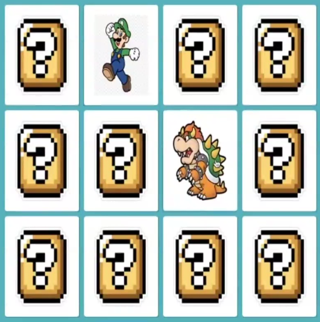

# Jogo da Memória - HTML, CSS e JavasCript

Projeto desenvolvido durante o **Bootcamp TQI Fullstack Developer** na plataforma [DIO](https://web.dio.me/), sob orientação da instrutora **Gabriela Pinheiro**. O objetivo é criar um jogo da memória funcional, focando em animações 3D com CSS e lógica de manipulação do DOM com JavaScript.

<p align="center">
  
</p>

## Sobre o Projeto

O projeto consiste em um tabuleiro de 12 cartas inspiradas no universo do Mario. A aplicação foca na experiência do usuário através de efeitos visuais realistas e uma lógica de jogo robusta que impede comportamentos inesperados.

### Principais Funcionalidades:

* **Animações 3D**: Uso de perspectiva e rotação no eixo Y para simular a virada das cartas.
* **Lógica de Match**: Verificação automática de pares idênticos utilizando atributos `data-` no HTML.
* **Sistema de Trava (Lock Board)**: Impede que o usuário vire mais de duas cartas simultaneamente durante o processamento da rodada.
* **Embaralhamento Dinâmico**: As cartas são reorganizadas aleatoriamente a cada carregamento de página utilizando uma IIFE (*Immediately Invoked Function Expression*).

---

## Tecnologias Utilizadas

- **HTML5**: Estruturação semântica do tabuleiro e contêineres das cartas.
- **CSS3**:
    - **Flexbox**: Para o layout responsivo do grid.
    - **Perspective e 3D Transform**: Para o efeito visual de profundidade e rotação.
    - **Backface-visibility**: Para esconder a face traseira da carta durante a animação.
- **JavaScript (ES6+)**:
    - **DOM Manipulation**: Seleção e alteração de classes de elementos.
    - **Event Listeners**: Captura de cliques para interatividade.
    - **Funções Assíncronas (`setTimeout`)**: Para controlar o tempo de exibição das cartas antes de desvirá-las em caso de erro.
    - **Array Destructuring**: Utilizado para resetar as variáveis de estado de forma limpa.

---

## Lógica de Programação

Abaixo, alguns destaques da implementação lógica:

### Identificação de Cartas

Cada carta possui um atributo `data-card` que permite ao JavaScript comparar o conteúdo sem depender de nomes de arquivos ou classes CSS complexas:

```html
<div class="card" data-card="mario">
  </div>
```

### Otimização de Cliques

Para garantir a fluidez, o código trata casos de erro como o "duplo clique" na mesma carta, impedindo que o sistema valide uma carta consigo mesma como um par:

```javascript
if (this === firstCard) return;

```

### Embaralhamento (Shuffle)

A função de embaralhamento utiliza a propriedade CSS `order` combinada com `Math.random` para reposicionar as cartas no flex container sem alterar o HTML.

---

## Como Executar

1. Clone o repositório:

```bash
git clone https://github.com/SEU_USUARIO/NOME_DO_REPOSITORIO.git

```

2. Abra o arquivo `index.html` em seu navegador.

---

## 👩‍🏫 Créditos

* **Instrutora**: Gabriela Pinheiro (Software Engineer @ Caju).
* **Plataforma**: [Digital Innovation One (DIO)](https://www.dio.me/).

---

*Este projeto faz parte do meu aprendizado em desenvolvimento Fullstack. Sinta-se à vontade para entrar em contato ou dar um fork!*

